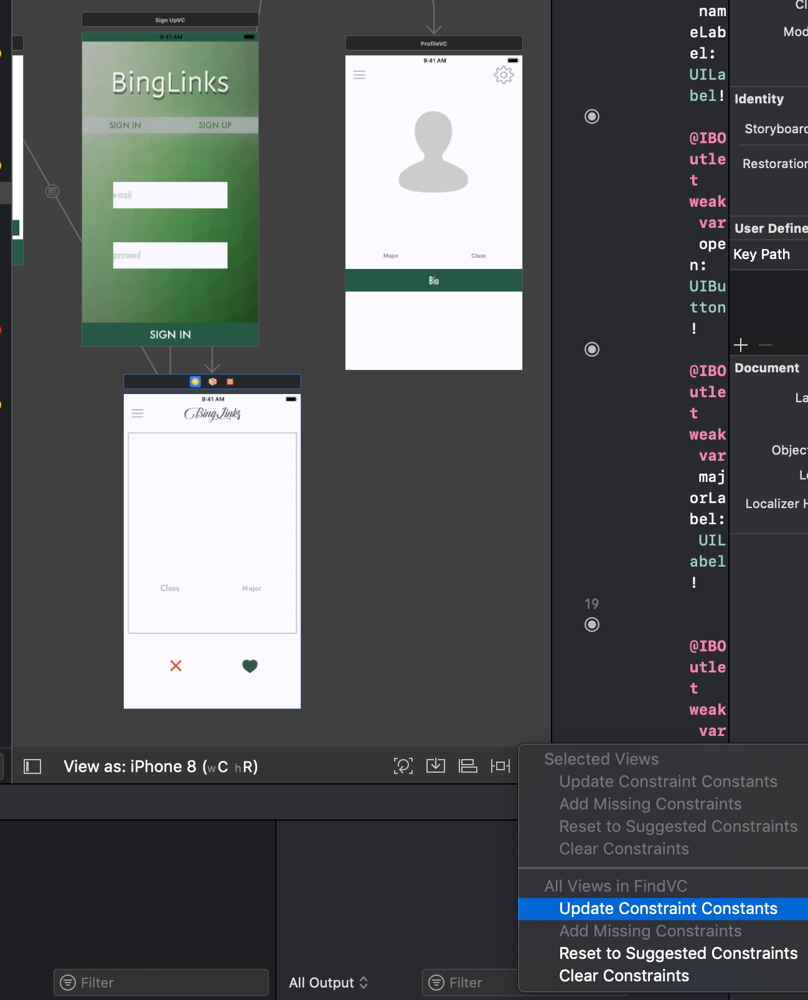

## Wrapping Up

# Testing, Building, and Deploying
  Hopefully, by now you have been regularly building and running your app with Xcode's iPhone simulator. You may have noticed that it takes a few seconds to build and re-build your application for each change that you make. This can become tedious when testing large-scale applications, which is why it is important to add unit/UI tests to your project prior to releasing your app for production.    
  When you decide to release your app, Apple has tons of resources explaining how to enroll in Apple's Developer Program, how to generate your deployment/distribution certificates, and receiving a code-signing identifier. It's actually a pretty straightforward process, but it's a bit too nuanced to explain today in our workshop.

# Pros and Cons of Firebase
  Firebase's realtime database is a great solution for rapid iteration when creating an application. It's completely free for small-scale hobbyist projects, and it allows you to avoid writing a single line of server-side code. The set-up for a Firebase project takes minutes, while setting up a remote server, buying a domain, purchasing hosting, generating an SSL protocol, redirecting nameservers, etc. can take days or weeks.     However, Firebase has several drawbacks. Most notably, it can become very expensive for any non-personal projects. This cost is probably warranted, as Firebase comes with tons of tools that aren't easily replicated. Additionally, Firebase does not currently support complex queries. Searching for a value in a table created with MySQL is often a trivial task, whereas it can be quite challenging with Firebase's JSON-structured databases.

# Constraints
  In the "Building Visual Interfaces" section of this tutorial, you may have noticed that the UI of your app looks different depending on which simulator you use. Because Apple phones can vary in size and dimension, your app will never look 100% identical on two different devices. However, with layout constraints, developers can attempt to make their apps look as similar as possible, no matter which device they are ran on. Layout constraints can be quite difficult to figure out at first, but, a quick work-around is to set the constraints of your view controllers to the default auto-suggested ones. To do this, select any view controller in your storyboard, and click the button on the bottom, far right of your storyboard. When you mouse over it it will say "resolve auto layout issues." This is definitely not a fix that works 100% of the time, but it often will save you tons of time.
  

# Next Steps
  By now, hopefully you have a decent grasp of the basics of Swift and Xcode. Thanks for coming! Some common functionality of iOS development that you may want to look into on your own includes:    
  <a href="https://blog.usejournal.com/custom-uiview-in-swift-done-right-ddfe2c3080a">Custom UI Views</a>
  <a href="https://developer.apple.com/library/archive/referencelibrary/GettingStarted/DevelopiOSAppsSwift/CreateATableView.html">Table Views</a>
  <a href="https://medium.com/ios-os-x-development/managing-async-code-in-swift-d7be44cae89f">Asynchronous Calls</a>
  <a href="https://firebase.googleblog.com/2013/10/queries-part-1-common-sql-queries.html">Complex Firebase/SQL Queries</a>
  Instead, if you want to become more comfortable with Swift, please check out some of the Swift programming resources included at the start of the workshop. <a href="README.md">README</a>

# Sections

<a href="Visual-Interfaces.md">Building Visual Interfaces</a>
  Intro to Xcode
  Designing Visual Interfaces
  Segues

<a href="ViewControllers.md">View Controllers</a>
  IBOutlets and IBActions
  Making Your Visual Interfaces Interactive
  Passing Data Between View Controllers

<a href="Frameworks.md">CocoaPods, APIs, and Frameworks</a>
  What is CocoaPods?
  Adding, Installing, and Updating Pods

<a href="Firebase.md">Firebase Integration</a>
  What is Firebase?
  Setting Up
  User Authentication
  Posting User Data
  Fetching User Data

<a href="Conclusion.md">Wrapping Up</a>
  Testing, Building, and Deploying
  Pros and Cons of Firebase
  Constraints
  Next Steps
