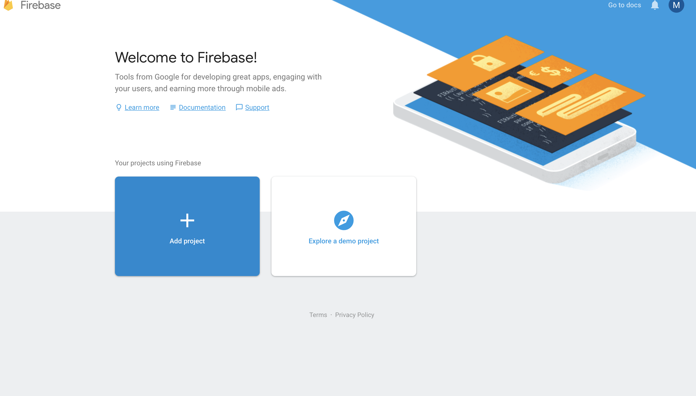
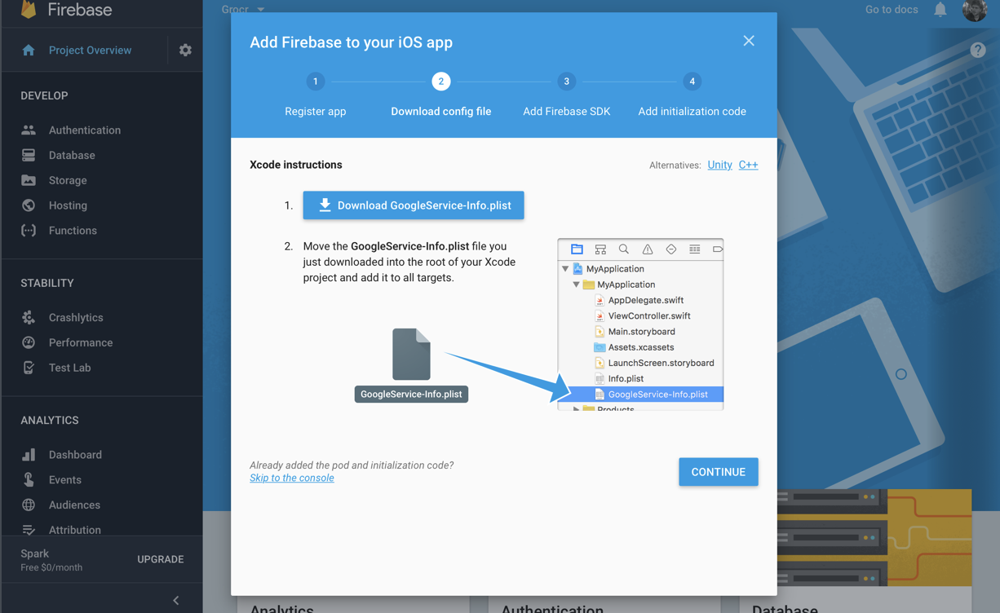
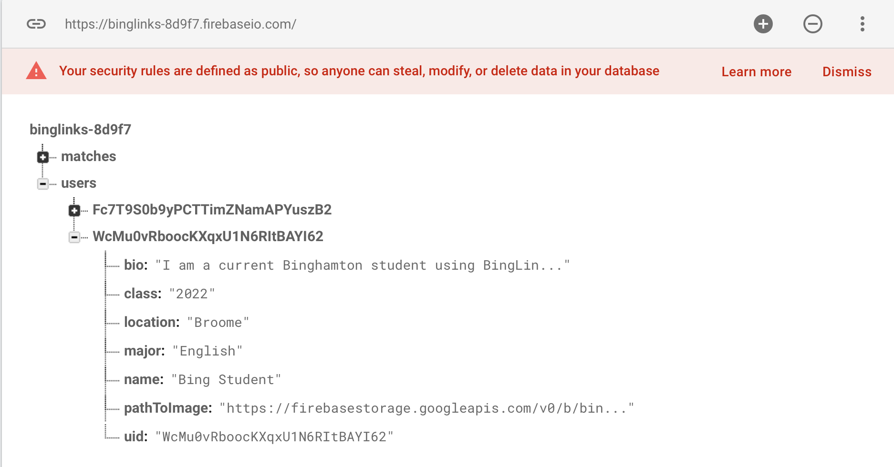

# Firebase Integration

# What is Firebase?
Firebase is a no-SQL realtime database that allows us to integrate back-end operations without implementing any server-side code.

# Setting Up
Now that we have the Firebase pods added to our project, we need to create a reference to our iOS app in a new Firebase project at https://firebase.google.com. Select "go to console," and then "add project":

When prompted, enter the name of your iOS app. The project ID will be automatically generated for you, and you can leave it as is. From there, go to the console and click on the iOS button. You will be instructed to add some information about your app. At step 2, you will be prompted to download a file entitled "GoogleService-Info.plist" and add it to the directory of your Xcode project:

This file is called a property list, essentially, it stores some information about your iOS application and the location/URL of your Firebase database. Now that this is done, we just need to permit users to make reads and writes into our database. We already have added the Firebase pods, so we can ignore step 4. All we have left is to configure our app with Firebase, in our AppDelegate.swift file, by entering the line:
```Swift
FirebaseApp.configure()
```
inside of the didFinishLaunchingWithOptions function. Additionally, we will need to import Firebase at the top of our file.

# User Authentication
Now that Firebase is integrated with our project, we can start to add database operations. Firstly, we should add a user authentication/sign-up feature. In your Sign-In view controller import Firebase. Your Firebase sign-in function may look something like this:

```Swift
@IBAction func signInAttempt() {
  let auth = Auth.auth()
  let ref = Database.database().reference()
  let defaults = UserDefaults.standard


  auth.signIn(withEmail: emailField.text!, password: pwField.text!) { (user, error) in

    if error == nil {
      let user = Auth.auth().currentUser!

      defaults.set(self.emailField.text, forKey: "email")
      defaults.set(self.pwField.text, forKey: "password")
      defaults.set(user.uid, forKey: "uid")
      defaults.synchronize()


      ref.child("users").child(user.uid).child("uid").setValue(user.uid)
      self.dismiss(animated: true, completion: nil)
      } else {
        let alert = UIAlertController.init(title: "Failed to sign-in to account", message: error!.localizedDescription, preferredStyle: UIAlertControllerStyle.alert)
        alert.addAction(UIAlertAction.init(title: "Ok", style: UIAlertActionStyle.default, handler: nil))
        self.present(alert, animated: true, completion: nil)
        return
      }
    }
  }
```
  The first 3 lines create references to Firebase's authorization framework, our Firebase database, and our locally stored user defaults property list file. The syntax of the signIn function may appear strange to anyone without experience in Swift. This function is asynchronous, meaning that it runs on a separate thread than the main UI thread. The purpose of this is so that users can still interact with the app while API calls are in progress. When the signIn call is completed, it enters a completion block, where either a user object is returned, if the sign-in attempt was successful, or an error is thrown, if the attempt failed. If the user object is returned successfully, we can exit the current view, revealing a separate view controller. If an error is thrown, an alert message is displayed.

  # Posting User Data
  Before our sign-in functionality can work properly, we probably should implement a sign-up feature. In a separate view controller for managing user sign ups, we'll add a function that attempts to create a user object with an email and password entered into 2 text fields:

  ```Swift
  @IBAction func signUpPressed() {
    guard emailField.text != nil, (emailField.text?.contains("@"))!, (emailField.text?.count)! < 30, (emailField.text?.count)! > 1, (bioView.text?.count)! > 1, (classField.text?.count)! > 1, (majorField.text?.count)! > 1, img != nil else {
      return
    }
    let defaults = UserDefaults.standard

    let ref = Database.database().reference()

    Auth.auth().createUser(withEmail: emailField.text!, password: pwField.text!) { (user, error) in

      if error == nil {
        let user = Auth.auth().currentUser!

        defaults.set(self.emailField.text, forKey: "email")
        defaults.set(self.pwField.text, forKey: "password")
        defaults.set(user.uid, forKey: "uid")
        defaults.synchronize()

        let metadata = ["bio" : self.bioView.text!,
        "class" : "\(self.classField.text!)",
        "major" : self.majorField.text!,
        "name" : self.nameField.text!,
        "uid" : user.uid]
        ref.child("users").child(user.uid).updateChildValues(metadata)


        self.uploadImage(uid: user.uid)


        let alert = UIAlertController.init(title: "Created account successfully", message: "Thanks for joining BingLinks!", preferredStyle: UIAlertControllerStyle.actionSheet)
        alert.addAction(UIAlertAction.init(title: "Done", style: UIAlertActionStyle.default, handler: nil))
        self.present(alert, animated: true, completion: nil)

        } else {
          let alert = UIAlertController.init(title: "Account creation failed", message: error!.localizedDescription, preferredStyle: UIAlertControllerStyle.alert)
          alert.addAction(UIAlertAction.init(title: "Ok", style: UIAlertActionStyle.default, handler: nil))
          self.present(alert, animated: true, completion: nil)
          return
        }
      }
    }
```
    Our guard statement "validates" our text fields and makes sure our profile image has been set. Syntactically, the createUser method is similar to signIn. First, we let FirebaseAuth attempt to create a user. If the user is created successfully, we will post a dictionary with our user's metadata to our database. Additionally, we will call a separate method to upload a user's profile image. Then, we will display an alert to notify users whether or not their account was created successfully. If not, then we will display the error message. Firebase will populate the database in realtime when these functions are called, as seen here:
    

    # Fetching User Data
    We just saw how to post data to our database, now let's look at reading from our database. In our demo app, we have several view controllers that read from the database. The most straightforward is the Profile view controller. This file reads from our database once, and searches for several different fields. If these fields are found, the data will be retrieved and stored in the corresponding text fields of our view controller.

    ```Swift
    let ref = Database.database().reference()
    let uid = Auth.auth().currentUser?.uid

    ref.child("users").child(uid!).observeSingleEvent(of: .value, with: { snapshot in
      guard snapshot.exists() else {
        return
      }
      let data = snapshot.value as! [String : AnyObject]

      if let name = data["name"] as? String, let bio=data["bio"] as? String, let year=data["class"] as? String, let imagePath = data["pathToImage"] as? String, let major = data["major"] as? String {

        self.txtView.text = bio
        self.nameLabel.text = name
        self.majorLabel.text = major
        self.classLabel.text = year
        self.imageDisplay.downloadImage(from: imagePath)
      }
      ref.removeAllObservers()
      })
      ```
      The method signature for "observeSingleEvent" should look familiar after writing the sign-in/sign-up methods. This function tells the database to read from the database once, and look for the keys "name," "bio," "class," "pathToImage," and "major."


      # Sections


      <a href="Visual-Interfaces.md">Building Visual Interfaces</a>
      Intro to Xcode
      Designing Visual Interfaces
      Segues


      <a href="ViewControllers.md">View Controllers</a>
      IBOutlets and IBActions
      Making Your Visual Interfaces Interactive
      Passing Data Between View Controllers


      <a href="Frameworks.md">CocoaPods, APIs, and Frameworks</a>
      What is CocoaPods?
      Adding, Installing, and Updating Pods

      <a href="Firebase.md">Firebase Integration</a>
      What is Firebase?
      Setting Up
      User Authentication
      Posting User Data
      Fetching User Data

      <a href="Conclusion.md">Wrapping Up</a>
      Testing, Building, and Deploying
      Custom UI Views
      Pros and Cons of Firebase
      Constraints
      Next Steps
