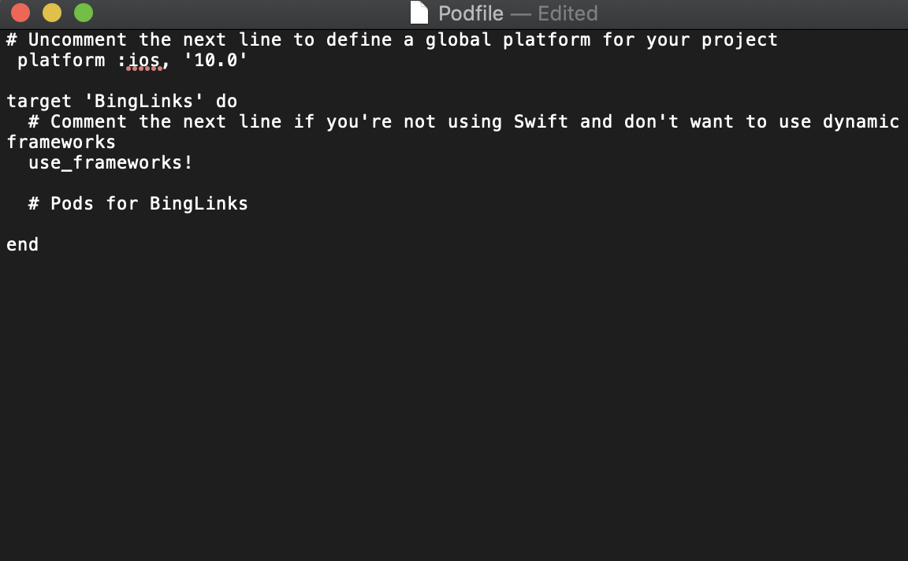
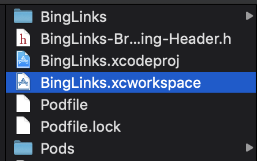

## CocoaPods, APIs, and Frameworks
In this section we will discuss the integration of CocoaPods and various frameworks into our project.

# What is CocoaPods?
CocoaPods is a dependency manager for Xcode frameworks. When adding a framework to your project, CocoaPods automatically creates a new .xcworkspace file, links your dependencies in your target's build phases, and configures your target to be compatible with your dependencies.

# Adding, Installing, and Updating Pods
To install CocoaPods on your Mac, you will need to use the terminal. When inside of a terminal, run the command
```
sudo gem install cocoapods
```
This will add the CocoaPods gem to your Mac. Next, cd into your project directory. When inside of your project's directory, run
```
pod init
open Podfile
```
Your podfile should look similar to this:

From here, we can add any frameworks that we'd like to integrate in our project. For example, the demo project includes libraries like GoogleMaps, Firebase, and JSQMessages. In this workshop we will discuss Firebase integration. To install this Pod, we'll add the following lines to our Podfile:
```
pod 'Firebase/Core'
pod ‘Firebase/Auth’
pod ‘Firebase/Database’
pod ‘Firebase/Storage’
```
Next, we'll re-enter the terminal, and type
```
pod install
```   
This should add the following frameworks to your project. Now, we will need to exit Xcode, and re-open it. From now on, we need to use the .xcworkspace file, instead of the .xcodeproj file.



Now we have the necessary Firebase modules added to our project.

# Sections


<a href="Visual-Interfaces.md">Building Visual Interfaces</a>
Intro to Xcode
Designing Visual Interfaces
Segues


<a href="ViewControllers.md">View Controllers</a>
IBOutlets and IBActions
Making Your Visual Interfaces Interactive
Passing Data Between View Controllers


<a href="Frameworks.md">CocoaPods, APIs, and Frameworks</a>
What is CocoaPods?
Adding, Installing, and Updating Pods

<a href="Firebase.md">Firebase Integration</a>
What is Firebase?
Setting Up
User Authentication
Posting User Data
Fetching User Data

<a href="Conclusion.md">Wrapping Up</a>
Testing, Building, and Deploying
Custom UI Views
Pros and Cons of Firebase
Constraints
Next Steps
