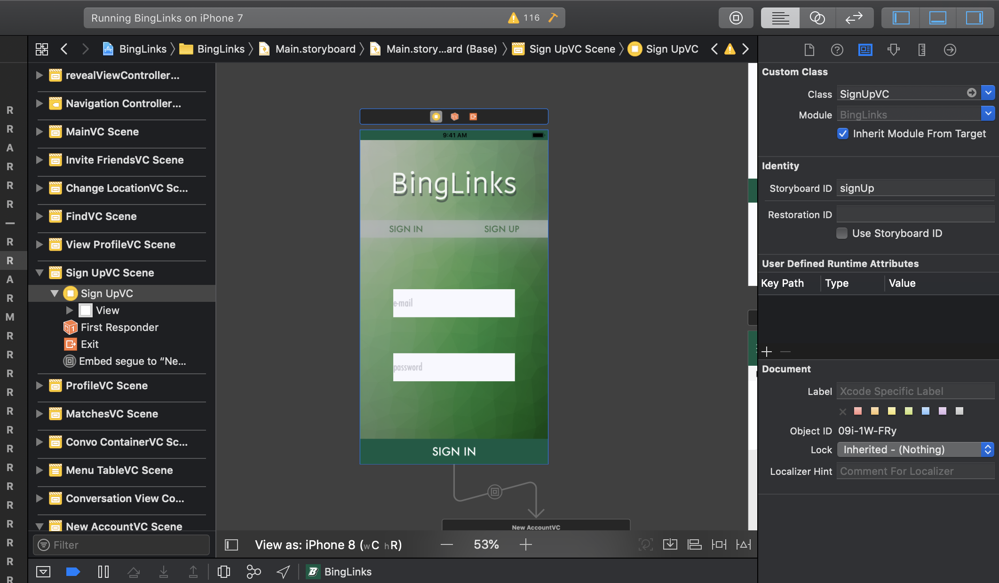
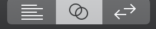

## View Controllers
The view controller is the mobile equivalent to a webpage. They can be dynamic or static, and generally you'll need to press a button or interact with the screen to navigate to a different view controller. If you've followed up until this point of the demo, you've probably noticed that currently we have several static view controllers, but no way to navigate between them. This is where our Swift view controller files come into play. <br /> <br />

# IBOutlets and IBActions
IBOutlets and IBActions are how your storyboard's view controllers are "wired" to functions, properties, and interactions that you have written in your Swift files. IBOutlets are used for assigning or accessing attributes of UI elements like buttons, labels, table views, etc. IBActions are functions attached to a given UI element. To give an example, if you have a label that you want to assign a border to, you'll need to link it to an IBOutlet. If you'd like to make your label increment a counter variable when clicked, for example, you will need to link it to an IBAction as well. Most of the views in your view controller will be IBOutlets, except for ones that are completely static. <br /> <br />

# Making Your Visual Interfaces Interactive
First, we'll need to create a new UIViewController. Let's do this by clicking on the top of the first screen we introduced, the welcome screen. From there, we will need to enter the name of our view controller Swift file; feel free to name yours whatever you'd like, I named mine "SignUpVC": <br /> <br />




# Adding IBOutlets and IBActions to your view controller
IBOutlets and IBActions are added to a project much in the same way that segues are created (CTRL-drag). However, instead of CTRL-dragging from one view controller to the next, IBOutlets and IBActions are created by CTRL-dragging a UI element in a view controller, into its corresponding Swift file. Note that this will not work until after you have given your view controller a corresponding Swift file. You will have to split your screen so that the assistant editor is open. The assistant editor enables you to work on a UI storyboard simultaneously with its corresponding Swift file. To open this editor, click the middle button in the top right corner of the IDE (it should look like 2 circles): <br /> <br />




# Passing Data Between View Controllers
There are many ways to persist data between view controllers. If using a segue, your function to pass data between two screens will appear something like this. <br /> <br />
```Swift
override func prepare(for segue: UIStoryboardSegue, sender: Any?) {
  if segue.identifier == "someIdentifier" {
    if let nextVC = segue.destinationViewController as? NextViewController {
      nextVC.data = sender.data
    }
  }
}
```
the prepare function is called automatically whenever a segue occurs in your application, regardless of whether or not you have overwritten it. The first line in this function is necessary if there are multiple segues in your view controller that are directed to different locations. The second line creates an instance of the destination view controller, and the following line passes a member of the first screen to the next one. Alternatively transitions between view controllers can be added programmatically; this is especially useful when you have a transition that should only happen if a pre-condition is met. Uses for programmatic transitions include functionality like signing-in to your app. <br /> <br />
```Swift
@IBAction func openScreen(sender: AnyObject) {
  guard SOME_PRECONDITION else {
    return
  }
  var nextView: MainScreen = MainScreen(withIdentifier: "main", bundle: nil)
  self.presentViewController(nextView, animated: true, completion: nil)
}
```
The above code is triggered when a button wired to an IBAction is pressed. If the boolean SOME_PRECONDITION is false, the function will return, without linking to another view controller. If the flag is set, however, a new screen, with an identifier "main," and a UIViewController Swift file named MainScreen.


# Sections


<a href="Visual-Interfaces.md">Building Visual Interfaces</a>
Intro to Xcode <br />
Designing Visual Interfaces <br />
Segues <br />


<a href="ViewControllers.md">View Controllers</a>
IBOutlets and IBActions <br />
Making Your Visual Interfaces Interactive <br />
Passing Data Between View Controllers <br />


<a href="Frameworks.md">CocoaPods, APIs, and Frameworks</a>
What is CocoaPods? <br />
Adding, Installing, and Updating Pods <br />

<a href="Firebase.md">Firebase Integration</a>
What is Firebase? <br />
Setting Up <br />
User Authentication <br />
Posting User Data <br />
Fetching User Data <br />

<a href="Conclusion.md">Wrapping Up</a>
Testing, Building, and Deploying <br />
Custom UI Views <br />
Pros and Cons of Firebase <br />
Constraints <br />
Next Steps <br />
