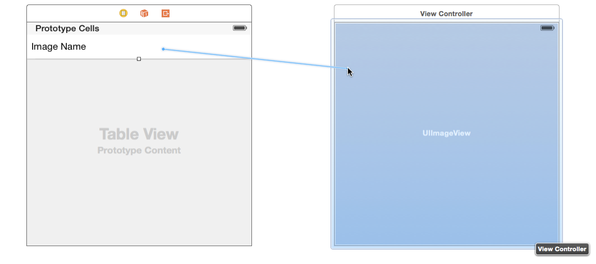

## Building Visual Interfaces
In this section we will first take a look at the user interface of Xcode. It is an extremely robust IDE that has too many capabilities to discuss in the span of our workshop. However, we will explain a few of the more critical ones. Next, we will learn how to build visual interfaces. Xcode provides a visual editor for storyboards, which allows you to lay out and design the user interface of your app without writing any code. &nbsp; \s\s

#   Intro to Xcode
Upon opening Xcode, you should see a modal saying "Welcome to Xcode," below this it should display several options for staring your project. On the right is a list of your recently opened .xcworkspaces and .xcodeprojs (we'll touch upon the difference between these two later, in the CocoaPods and Frameworks section). Select "Create a New Project," and from the next screen select "Single View App." Before your Xcode project is created, you will need to fill out several options, many of which may seem confusing. Most of them will not affect us for the purpose of the workshop at all. However, they are important if you choose to enter Apple's Developer Program and release your app in the future. For now, you can fill in the options as follows: &nbsp; \s\s
Product Name: (Up to you) &nbsp; \s\s
Team: Leave as is &nbsp; \s\s
Organization Name: Use your name &nbsp; \s\s
Organization Identifier: com.YOURNAME – this field is arbitrary, unless you decide to &nbsp; \s\s
Bundle Identifier: com.YOURNAME.PRODUCTNAME - Xcode will generate your app's bundle ID, which is essentially a unique &nbsp; \s\s identifier for your app
Language: Swift - Objective-C is Swift's predecessor, some companies still choose to use it, but it is now deprecated, and Apple pushes its developers to migrate to Swift.
Use Core Data: [unchecked] – Core Data is utilized for data persistence between sessions. It's a bit complicated for our workshop, as there are other options for data persistence that are faster and easier.
Include Unit Tests: [unchecked] – Testing? Never heard of it.
Include UI Tests: [unchecked] – In all seriousness, unit tests and UI tests are two extremely useful tools when building a production app, but definitely not necessary for today. &nbsp; \s\s

#   Designing Visual Interfaces
With all the setup out of the way, it's time to start building our application. From the navigation area, you should see a file entitled Main.storyboard. Open this, and you should see a single empty view controller. This will be the first screen our app opens to, and we will use it to either load our main screen, if a user is logged in, or, provide the option for a user to sign in or log into their account. To start adding UI elements to your view controller, move your cursor to the top of the screen, and select View->Libraries->Show Media Library. From there, a new window will pop up displaying tons of UI elements. To add these UI elements to your app, simply drag them from the library modal, onto your view controller. You can add new screens to the editor as well. Once you are pleased with the look of your view controller(s), try building and running your app with a simulator (play button in the top left corner of the screen), so that you can see how it would look on a live phone. Depending on what model phone you select, it may or may appear slightly different. We'll explain how this can be avoided later on in the workshop. &nbsp; \s\s

#   Segues
By now, you likely have several screens currently visible on your storyboard. You may be wondering how these screens interact with each other, and even how a user can navigate from one screen to another. We will explore this further later on, but one way to connect two view controllers is through segues. Segues are non-programmatically created screen transitions that are triggered by interactions with buttons. To create a segue from one view controller to the next, simply control-click and drag from a button on the start controller, to the new controller. You should see a light blue line while you are dragging your cursor, and a small popup upon releasing displaying the different type of segues. For now, select "present view controller modally," or "show." &nbsp; \s\s

# Sections

<a href="Visual-Interfaces.md">Building Visual Interfaces</a>
Intro to Xcode
Designing Visual Interfaces
Segues

<a href="ViewControllers.md">View Controllers</a>
IBOutlets and IBActions
Making Your Visual Interfaces Interactive
Passing Data Between View Controllers

<a href="Frameworks.md">CocoaPods, APIs, and Frameworks</a>
What is CocoaPods?
Adding, Installing, and Updating Pods

<a href="Firebase.md">Firebase Integration</a>
What is Firebase?
Setting Up
User Authentication
Posting User Data
Fetching User Data

<a href="Conclusion.md">Wrapping Up</a>
Testing, Building, and Deploying
Custom UI Views
Pros and Cons of Firebase
Constraints
Next Steps
